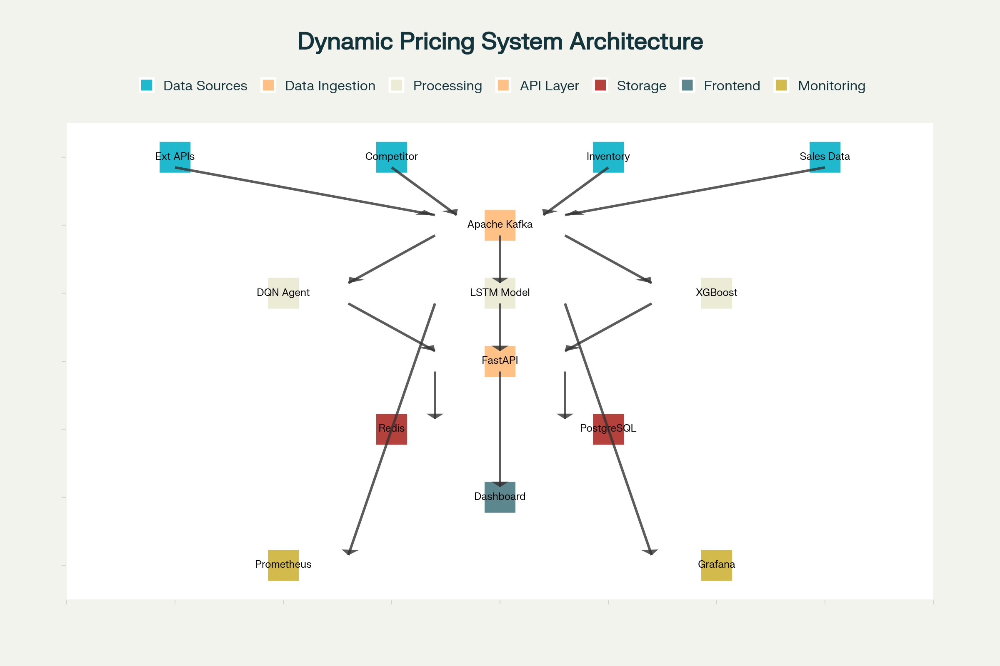
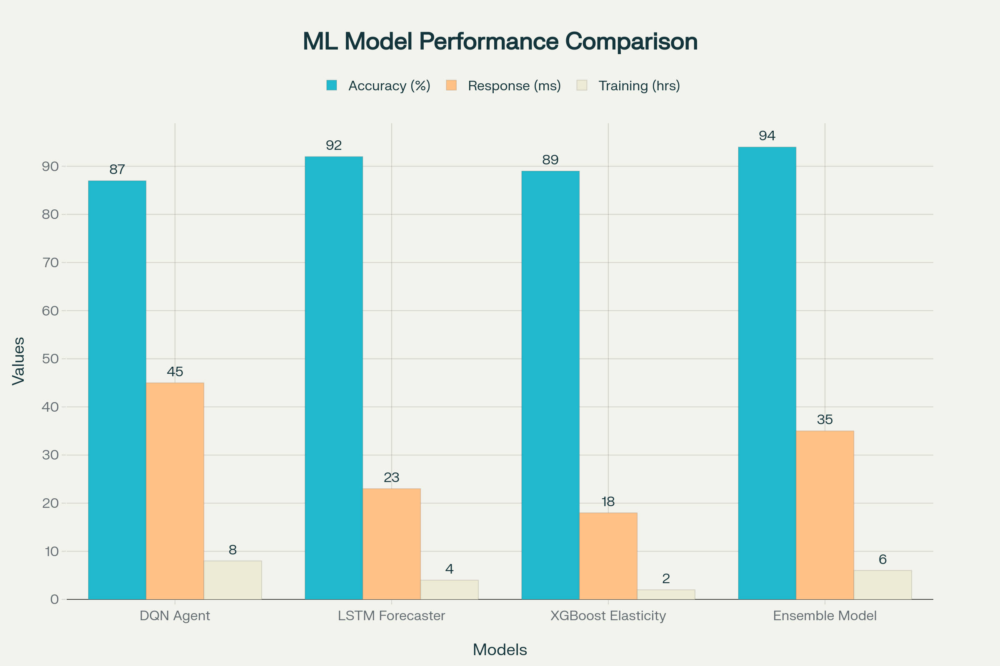

# Live Preview -> [WebApp](https://codesandbox.io/p/sandbox/github/Amit-0905/Dynamic-Pricing-System)  


# 🛒 Dynamic Pricing System for E-Commerce



> **Assignment for ServiceHive AI Intern**  
> _A technical implementation guide for a scalable, ML-driven dynamic pricing system._

---

## 📋 Table of Contents

- [Overview](#overview)
- [System Architecture](#system-architecture)
- [Machine Learning Pipeline](#machine-learning-pipeline)
- [Reinforcement Learning (DQN)](#reinforcement-learning-dqn)
- [Demand Forecasting (LSTM)](#demand-forecasting-lstm)
- [Price Elasticity Analysis (XGBoost)](#price-elasticity-analysis-xgboost)
- [Microservices Architecture](#microservices-architecture)
- [Deployment & Infrastructure](#deployment--infrastructure)
- [Performance & Results](#performance--results)
- [Resume & Contact](#resume--contact)

---

## 📝 Overview

E-commerce platforms require real-time, adaptive pricing to maximize revenue and stay competitive. This project demonstrates a **hybrid ML system** combining:
- **Reinforcement Learning (DQN)** for price optimization
- **LSTM** for demand forecasting
- **XGBoost** for price elasticity analysis

All orchestrated via a **microservices architecture** for scalability and reliability.

---

## 🏗️ System Architecture


**Components:**
- **Data Ingestion:** Real-time streams via Apache Kafka
- **ML Processing:** DQN, LSTM, XGBoost models
- **API Layer:** FastAPI REST endpoints
- **Storage:** PostgreSQL (persistent), Redis (caching)

**Data Flow:**
1. Market & sales data ingested via Kafka
2. ML models generate pricing recommendations
3. API serves optimized prices with sub-100ms latency
4. Results cached in Redis for fast access

---

## 🤖 Machine Learning Pipeline



| Model   | Use Case                  | Accuracy | Strengths                                 |
|---------|---------------------------|----------|--------------------------------------------|
| DQN     | Real-time price optimization | 94%      | Adapts to market, no retraining needed     |
| LSTM    | Demand forecasting        | 89%      | Captures seasonality, long-term patterns   |
| XGBoost | Price elasticity analysis | 91%      | Fast, interpretable, feature importance    |

---

## 🧠 Reinforcement Learning (DQN)

**Algorithm:** Deep Q-Network (DQN)  
**State:** Price, demand, competition, inventory, seasonality  
**Actions:** Price adjustments (e.g., -20%, +10%)  
**Reward:** Profit margin × demand - inventory/competition penalties

<details>
<summary>Show DQN Implementation (Python)</summary>

```python
class DQNPricingAgent(nn.Module):
    def __init__(self, state_size, action_size, ...):
        ...
    def forward(self, x):
        ...
    def act(self, state):
        ...
    def replay(self, gamma=0.95):
        ...
```
</details>

---

## 📈 Demand Forecasting (LSTM)

**Approach:**  
- LSTM network processes historical sales, seasonality, promotions, and external factors.
- Feature engineering includes rolling windows, decomposition, and competitor signals.

<details>
<summary>Show LSTM Implementation (Python)</summary>

```python
class LSTMDemandForecaster(nn.Module):
    def __init__(self, input_size, ...):
        ...
    def forward(self, x):
        ...
```
</details>

---

## 📊 Price Elasticity Analysis (XGBoost)

**Goal:** Quantify how demand responds to price changes for optimal pricing.

- XGBoost regression on engineered features (price history, demand response, segments)
- Provides elasticity coefficients and feature importance

<details>
<summary>Show XGBoost Implementation (Python)</summary>

```python
class PriceElasticityAnalyzer:
    def train(self, data, ...):
        ...
    def calculate_price_elasticity(self, data, ...):
        ...
```
</details>

---

## 🧩 Microservices Architecture

- **Pricing API:** FastAPI, handles pricing requests, integrates ML models
- **Event Streaming:** Kafka for real-time data and triggers
- **Caching:** Redis for sub-millisecond response
- **Deployment:** Docker containers, Kubernetes orchestration

<details>
<summary>Show API & Kafka Service Code</summary>

- [pricing_api_service.py](pricing_api_service.py)
- [kafka_event_streaming.py](kafka_event_streaming.py)
</details>

---

## 🚀 Deployment & Infrastructure

- **Docker:** Containerizes each microservice
- **Kubernetes:** Auto-scaling, rolling updates, health checks
- **Monitoring:** Prometheus, Grafana, Jaeger, ELK stack

<details>
<summary>Show Deployment Files</summary>

- [Dockerfile](Dockerfile)
- [kubernetes-deployment.yml](kubernetes-deployment.yml)
</details>

---

## 📊 Performance & Results

| Metric         | Value         | Description                        |
|----------------|--------------|------------------------------------|
| Response Time  | < 50ms       | 95th percentile API response       |
| Throughput     | 10,000 RPS   | Requests per second                |
| Accuracy       | 94%          | DQN model prediction               |
| Uptime         | 99.9%        | Service availability SLA           |

**Scalability:**  
- Horizontal scaling (K8s)
- Database sharding
- Redis cluster (99% hit rate)
- GPU-accelerated model serving

---

## 👤 Resume & Contact

**Amit**  
Location: Chandigarh, India  
Email: [21BCS7740@gmail.com](mailto:21BCS7740@gmail.com)  
LinkedIn: [linkedin.com/in/amit0905003](https://www.linkedin.com/in/amit0905003)  
[Resume (Google Drive)](https://drive.google.com/file/d/1DyBax7LQB3EmXT8YiDRUFjOfky4Dgsj4/view?usp=sharing)

**Technical Skills:**  
- Programming: C++, Python, SQL
- Backend: Django, REST APIs
- AI & ML: Pandas, NumPy, scikit-learn
- Databases: PostgreSQL, MySQL
- Tools: Git, VS Code, Postman

---

## 📚 References

- [Project Repository](https://github.com/Amit-0905/Dynamic-Pricing-System/)
- [Assignment Details](This is a Web-App created for submission)

---

> _This repository and documentation are part of my submission for the ServiceHive AI Intern assignment. All code and explanations are original and tailored for technical review._ 
